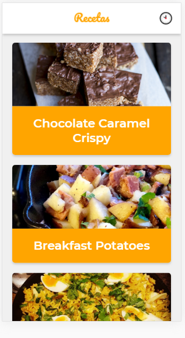

# Curso de PWA con Recat en Platzi

(./readme/Detail.png)

Este repositorio contiene todo el contenido del curso a medida que construimos una app para ver recetas con la API de MealDB.

feactures:

* Soporte offline con Workbox
* Estrategia de red apropieadas para cada recurso 
* add to Home Screen
* Web Share API
* Notificaction

## Scripts
* `npm install` para instalar dependencias
* `npm run dev` para entorno de desarrollo
* `npm run build && run start` para entorno de producción

[Ver la app en producción](https://platzi-pwa-master-fb75ouyi3.now.sh)

License:MIT